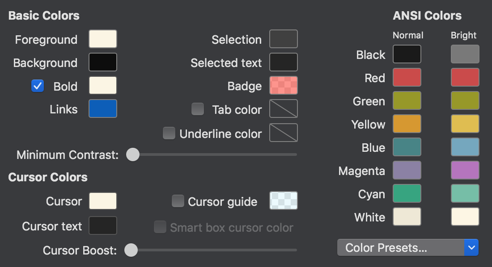
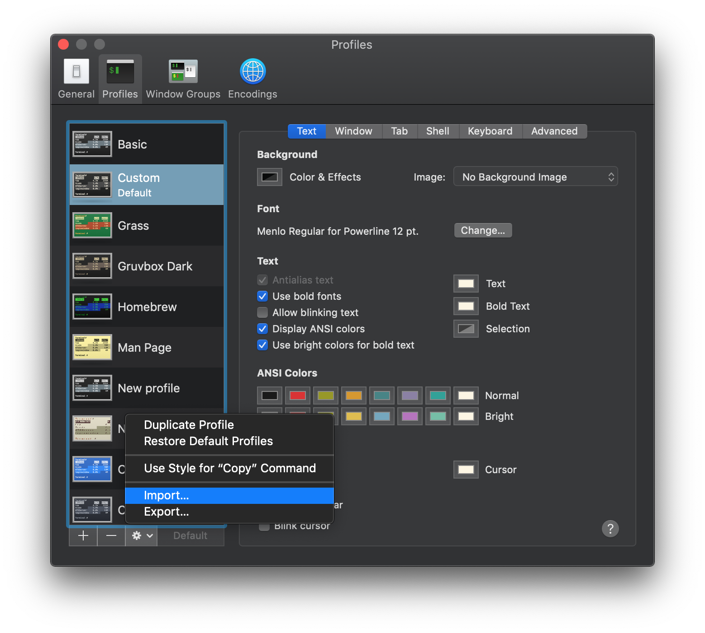
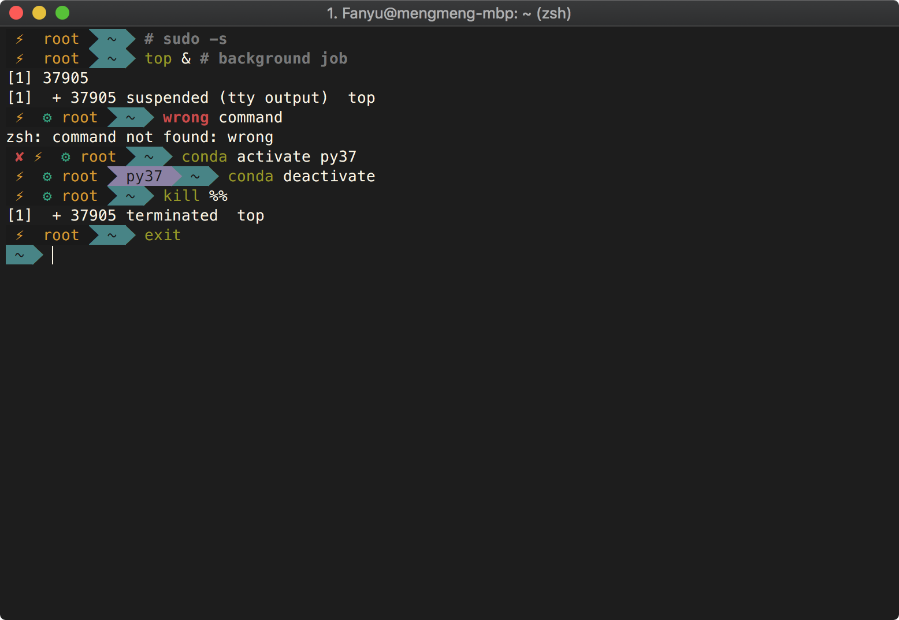
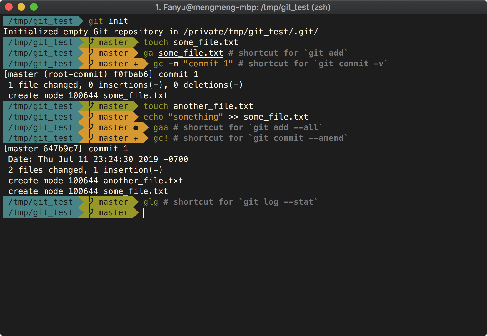

# Quick Install Zsh with Useful Customizations

This script installs Zsh with a custom agnoster theme and some userful plugins.

## Usages

- Run `sudo ./install.sh`;
- Confirm your default username. The command prompt will show your current 
  username unless it's currently on your default user. If you want to show 
  the current user at all time, answer `n` when prompted 
  `Is <USERNAME> your default user? [Y/n]` and leave blank when prompted 
  `Please enter your default user:`
- Set color scheme to your terminal according to the [color schemes](#color-schemes)
  section.

## Dependencies

The script currently only support macOS (tested on 10.14.5). The following 
dependencies and sources will be installed if not already:
- brew
- curl
- git
- python 
- zsh
- oh-my-zsh

## Included Customizations

The script installs a custom version of agnoster with the following 
customizations:
- Hide hostname and also hide username if operated by the default user;
- Collapse directories that are more than 4 depths deep;
- Prompt current virtual environment as a segment of agnoster and hide the 
  prompt when it's the default environment (e.g. `base` for conda).

The script also installs the following zsh plugins:
- `git`: adds git shortcut commands;
- [`autojump`](https://github.com/wting/autojump): smart directory jump;
- [`zsh-autosuggestions`](https://github.com/zsh-users/zsh-autosuggestions):
  command completion suggestion based on history;
- [`zsh-syntax-highlighting`](https://github.com/zsh-users/zsh-syntax-highlighting):
  syntax highlighting for command line prompt.

For examples, check out the [showcase](#showcase) section.

## Color Schemes

The repository currently offer the following color scheme for Mac Terminal and 
iTerm2.

 

### Mac Terminal 

- In `Terminal | Preferences... | Profiles`, click on the gear on the bottom left 
  and select `Import`, then import `profiles/custom.terminal`.

### iTerm2

- Copy `profiles/iterm_profile.json` to `~/Library/Application Support/iTerm2/DynamicProfiles`;
- In `iTerm2 | Preferences... | Profiles`, select "Custom" on the left.

## Showcase

